# MIT_BIH_AF
本文件夹是一个专门开发 CPSC2021 数据集的库

# 目录

- [1 介绍数据集 ](#1-介绍数据集)
  - [1.1 下载数据集](#下载数据集)
- [2 函数库使用](#2-函数库使用)
  - [2.1-读取dat,qrc,atr文件，获得 ECG_rpeaks，ann_aux_note，ann_sample，ECG0 ](#21-读取datqrcatr文件获得-ecg_rpeaksann_aux_noteann_sampleecg0)
  - [2.2-寻找时间点函数----signal_time_sample](#22-寻找时间点函数----signal_time_sample)
  - [2.3-寻找r_r峰在信号----find_r_r_peak](#23-寻找r_r峰在信号----find_r_r_peak)
  - [2.4-寻找-nr-峰信号以及位置----find_nr_peak](#24-寻找-nr-峰信号以及位置----find_nr_peak)
  - [2.5-找到范围内的所有-nr-峰----find_nr_peaks](#25-找到范围内的所有-nr-峰----find_nr_peaks)
  - [2.6-为信号建立伴随标注信号----afdb_create_mate_ann](#26-为信号建立伴随标注信号----afdb_create_mate_ann)
  - [2.7-重采样信号长度----resample_signal_length](#27-重采样信号长度----resample_signal_length)
  - [2.8 利用小波变换去噪滤波，小波变换去趋势----wavelet_denoise、wavelet_detrend](#28-利用小波变换去噪滤波小波变换去趋势----wavelet_denoisewavelet_detrend)

# 1 介绍数据集 
CPSC2021 全称是 第十届生物医学工程与生物技术国际会议(ICBEB 2021)）。数据集分两个阶段。第一个阶段采集有 49 名被采集者的心电信号。第二个阶段采集有 37 名被采集者的心电信号。一共有 1460 条心电信号。每条信号 几十秒-30 分钟。数据集中有对 房颤(  "(AFIB"  、 "(AFL"  )  正常 ( "(N" )   三种类型的心拍类型标注。

<left>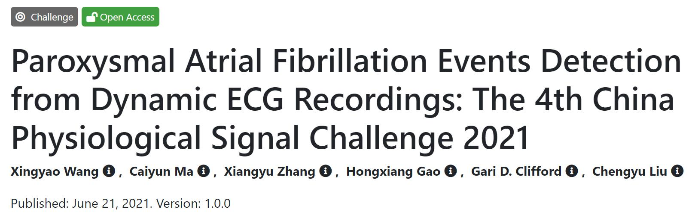<left>

## 下载数据集

数据集生理网下载地址：[https://www.physionet.org/content/cpsc2021/1.0.0/](https://www.physionet.org/content/cpsc2021/1.0.0/)

数据集一共两种类型的文件，分别是dat, atr后缀。不需要担心文件的陌生感，已经有团队专门开发出读取这些文件的python集成包----WFDB。

因此，使用数据集前需要在python环境安装该库：```pip install wfdb```

生理网的资料做的很全，不仅提供的数据集的下载，网站还提供了数据集的很多详细说明，如记录时长，采样率，患者描述等。更多信息需要自己多探索，而最常用的是快捷波形可视化。

数据集可视化地址：[https://www.physionet.org/lightwave/?db=cpsc2021/1.0.0](https://www.physionet.org/lightwave/?db=cpsc2021/1.0.0)

可视化界面显示了数据集的实际信号,界面如图：

<left>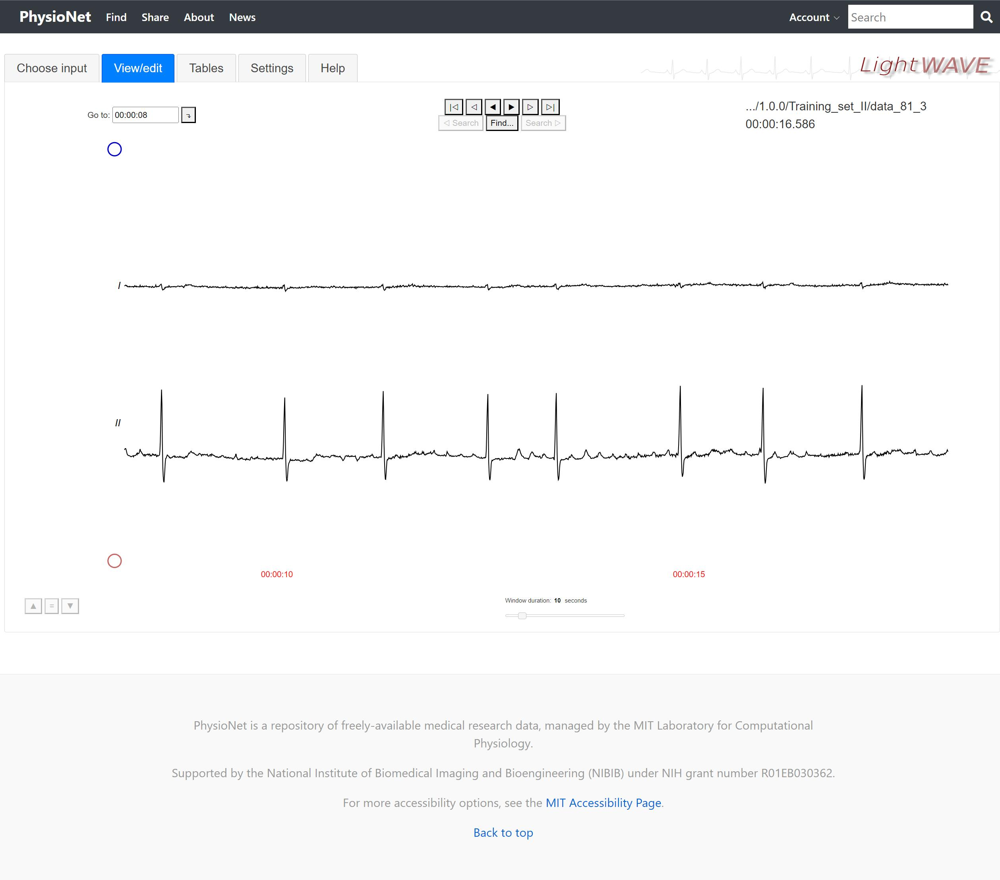<left>


# 2 函数库使用

如下介绍的库函数功能，都是平时用得最为频繁的基础功能，为了避免重复编写代码因此自己编写成库，使用代码```import CPSC2021_function as CPSC2021```将本文件夹代码库加载。

## 2.1 读取dat,qrc文件，获得 ECG_rpeaks，ann_aux_note，ECG0 

使用数据集主要通过读取文件，其中dat后缀是记录心电实际信号的文件，atr后缀是心电实际信号对应的标注文件。数据集所有的信息都在文件中。
```
import wfdb
import CPSC2021_function as CPSC2021
import matplotlib.pyplot as plt

patient_list = CPSC2021.get_patient_ids("C:/mycode/dataset/CPSC2021/")
index, info = CPSC2021.get_patient_info('data_81_3', patient_list)
print(info)

# 读取患者文件
record = wfdb.rdrecord(patient_list[index], physical=True)
signal_annotation = wfdb.rdann(patient_list[index], "atr")

ECG_rpeaks = signal_annotation.sample
ann_aux_note = signal_annotation.aux_note
ECG0 = record.p_signal[:, 0]
ECG1 = record.p_signal[:, 1]

plt.plot(ECG1[0:600])
plt.show()
```
输出：
|输出图片|端口输出|
|:--------------:|:-----:|
|<left>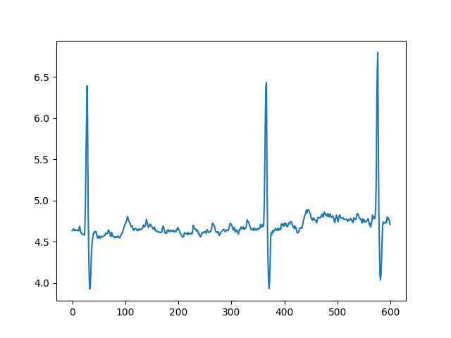<left>|<left>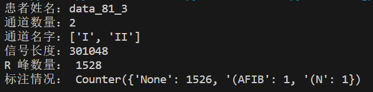<left>|


## 2.2 寻找时间点函数----signal_time_sample
本函数用于在代码中找到我们看到的感兴趣段落的位置。
如可视化界面我们的时间点为 "00:00:15.455"。

获取该处时间点在信号中的索引值，并展示
```
import wfdb
import CPSC2021_function as CPSC2021
import matplotlib.pyplot as plt

patient_list = CPSC2021.get_patient_ids("C:/mycode/dataset/CPSC2021/")
index, info = CPSC2021.get_patient_info('data_81_3', patient_list)

# 读取患者文件
record = wfdb.rdrecord(patient_list[index], physical=True)
signal_annotation = wfdb.rdann(patient_list[index], "atr")

# 获取关键信息
ECG_rpeaks = signal_annotation.sample
ann_aux_note = signal_annotation.aux_note
ECG0 = record.p_signal[:, 0]
ECG1 = record.p_signal[:, 1]

# 获取采样点
signal_point = CPSC2021.signal_time_sample("00:00:15.455",len(ECG0))

# 展示波形
plt.subplot(2,1,1)
plt.plot(ECG0[signal_point-500:signal_point+500], color='k')
plt.subplot(2,1,2)
plt.plot(ECG1[signal_point-500:signal_point+500], color='k')
plt.show()
```

|采样点|输出|
|:--------------:|:-----:|
|<left><left>|<left>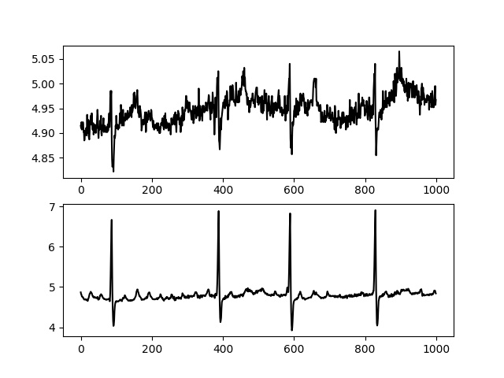<left>|

## 2.3 寻找R_R峰信号以及其位置----find_R_R_peak
日常使用时经常遇到提取单个R峰的情况，本函数具备此功能。

使用代码举例：
```
import wfdb
import CPSC2021_function as CPSC2021
import matplotlib.pyplot as plt

patient_list = CPSC2021.get_patient_ids("C:/mycode/dataset/CPSC2021/")
index, info = CPSC2021.get_patient_info('data_81_3', patient_list)

# 读取患者文件
record = wfdb.rdrecord(patient_list[index], physical=True)
signal_annotation = wfdb.rdann(patient_list[index], "atr")

# 获取关键信息
ECG_rpeaks = signal_annotation.sample
ann_aux_note = signal_annotation.aux_note
ECG0 = record.p_signal[:, 0]
ECG1 = record.p_signal[:, 1]

# 获取采样点
signal_point = CPSC2021.signal_time_sample("00:00:15.455",len(ECG0))

# 找到 R 峰信号，以及起止点
signal, s, e = CPSC2021.find_R_R_peak(signal_point, ECG1, ECG_rpeaks)

# 展示波形
plt.subplot(2,1,1)
plt.plot(ECG0[s:e], color='k')
plt.subplot(2,1,2)
plt.plot(ECG1[s:e], color='k')
plt.show()
```

|原采样点|采样出的R峰|
|:--------------:|:-----:|
|<left><left>|<left>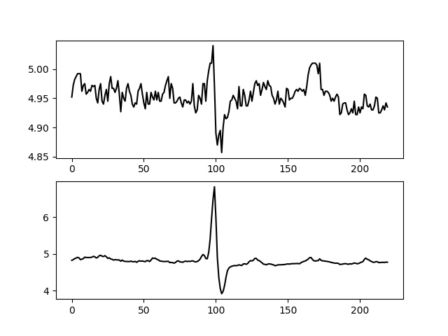<left>|

## 2.4 寻找 nR 峰信号以及位置----find_nR_peak
平时使用时，我们除了需要寻找一个 R 峰。我们还需要寻找 2，3，4，5，6，7....等n个连续R峰信号范围以及其信号位置。此函数可以完成此功能。

使用代码举例：
```
import wfdb
import CPSC2021_function as CPSC2021
import matplotlib.pyplot as plt

patient_list = CPSC2021.get_patient_ids("C:/mycode/dataset/CPSC2021/")
index, info = CPSC2021.get_patient_info('data_81_3', patient_list)

# 读取患者文件
record = wfdb.rdrecord(patient_list[index], physical=True)
signal_annotation = wfdb.rdann(patient_list[index], "atr")

# 获取关键信息
ECG_rpeaks = signal_annotation.sample
ann_aux_note = signal_annotation.aux_note
ECG0 = record.p_signal[:, 0]
ECG1 = record.p_signal[:, 1]

# 获取采样点
signal_point = CPSC2021.signal_time_sample("00:00:15.455",len(ECG0))

# 找到 nR 峰信号，以及起止点
signal1, s, e = CPSC2021.find_nR_peak(1, signal_point, ECG1, ECG_rpeaks)
signal3, s, e = CPSC2021.find_nR_peak(3, signal_point, ECG1, ECG_rpeaks)
signal5, s, e = CPSC2021.find_nR_peak(5, signal_point, ECG1, ECG_rpeaks)

# 展示波形
plt.subplot(3,1,1)
plt.plot(signal1, color='k')
plt.subplot(3,1,2)
plt.plot(signal3, color='k')
plt.subplot(3,1,3)
plt.plot(signal5, color='k')
plt.show()
```
|原采样点|采样出的 nR 峰|
|:--------------:|:-----:|
|<left><left>|<left>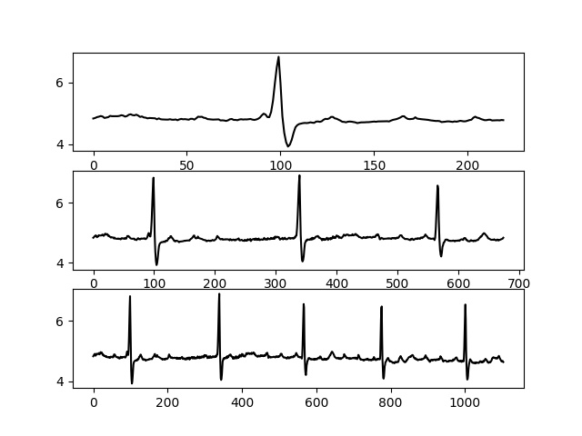<left>|


## 2.5 找到指定范围内的所有 nR 峰----find_nR_peaks
我们除了上面的要提取单独 nR 峰。很多情况下，我们还要在一段心电信号中提取出该段落的所有单个 nR 峰信号。下面代码展示了寻找一段信号中的所有 5R 峰的过程。

使用代码举例：
```
import wfdb
import CPSC2021_function as CPSC2021
import matplotlib.pyplot as plt

patient_list = CPSC2021.get_patient_ids("C:/mycode/dataset/CPSC2021/")
index, info = CPSC2021.get_patient_info('data_81_3', patient_list)

# 读取患者文件
record = wfdb.rdrecord(patient_list[index], physical=True)
signal_annotation = wfdb.rdann(patient_list[index], "atr")

# 获取关键信息
ECG_rpeaks = signal_annotation.sample
ann_aux_note = signal_annotation.aux_note
ECG0 = record.p_signal[:, 0]
ECG1 = record.p_signal[:, 1]

# 获取采样点
start_point = CPSC2021.signal_time_sample("00:00:09.424",len(ECG0))
end_point = CPSC2021.signal_time_sample("00:00:20.976",len(ECG0))

r_peaks_position = CPSC2021.find_nR_peaks(5, start_point, end_point, ECG1, ECG_rpeaks)
for (s,e) in r_peaks_position: 
    r_signal = ECG1[s:e]

    # 展示波形
    plt.plot(r_signal, color='k')
    plt.show()
```
原信号片段
<left>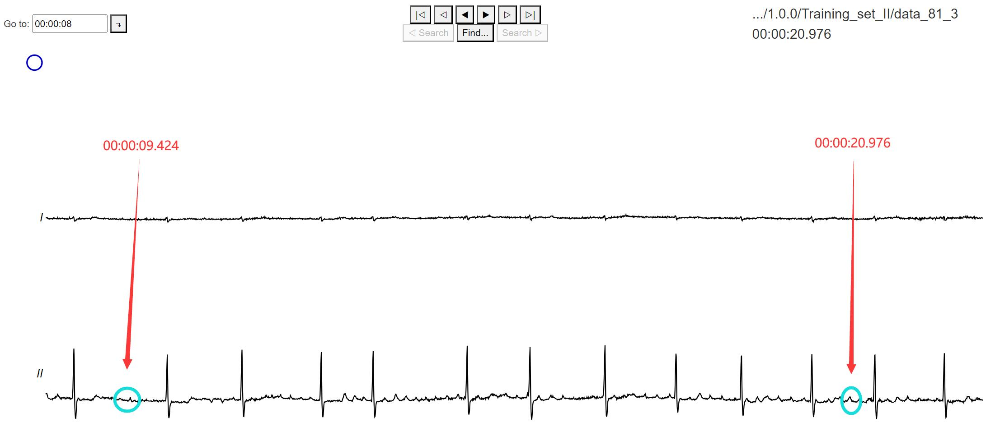<left>

找到的 5R 峰
|第 1 个 5R 峰|第 2 个 5R 峰|第 3 个 5R 峰|第 4 个 5R 峰|
|----|----|----|----|
|<left><left> |<left><left> |<left><left> |<left><left> |


## 2.6 为信号建立伴随标注信号----AFDB_create_mate_ann
建立伴随标注信号在代码中存在很大的好处。使得波形提取对应的标注更加方便。避免麻烦的原信号标注类型寻找。如图下面的波形可视化原信号，根据atr文件的标注可以看到，患者发生了一秒左右的房颤。但数据集并不是对每一个点进行标注，伴随标注信号应运而生。
<left><left>

使用代码举例：
```
import wfdb
import CPSC2021_function as CPSC2021
import matplotlib.pyplot as plt

patient_list = CPSC2021.get_patient_ids("C:/mycode/dataset/CPSC2021/")
index, info = CPSC2021.get_patient_info('data_32_8', patient_list)

# 读取患者文件
record = wfdb.rdrecord(patient_list[index], physical=True)
signal_annotation = wfdb.rdann(patient_list[index], "atr")

# 获取关键信息
ECG_rpeaks = signal_annotation.sample
ann_aux_note = signal_annotation.aux_note
ECG0 = record.p_signal[:, 0]
ECG1 = record.p_signal[:, 1]

# 建立信号伴随列表
ECG_ann = CPSC2021.create_mate_ann(len(ECG0), ECG_rpeaks, ann_aux_note)

plt.subplot(2,1,1)
plt.plot(ECG0, color='k')
plt.subplot(2,1,2)
plt.plot(ECG_ann, color='k')
plt.show()
```
运行结果如下，下图中第一张表是原信号，第二张表是伴随标注信号（"1"代表房颤，"0"表示正常）

<left>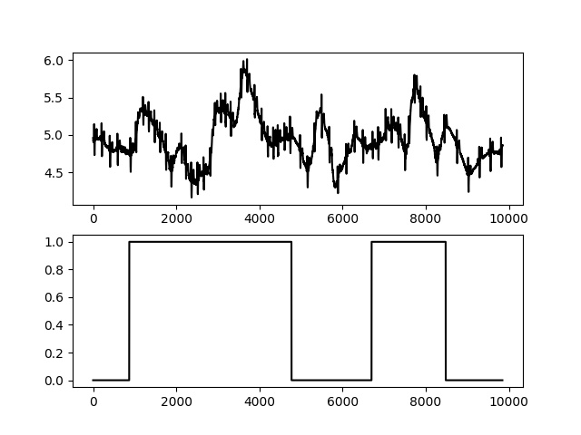<left>

## 2.7 重采样信号长度----resample_signal_length
在我们提取信号之后，最终将信号送入模型训练。但多数情况下，模型信号输入长度有要求。而我们采集的信号可能不是固定长度的，于是开发了本函数将一段信号重采样到指定的长度。注意本函数是基于 scipy 库实现的，如果出现缺少 scipy 库缺失相关的报错，请使用  ```pip install scipy```

使用代码举例：
```
import wfdb
import CPSC2021_function as CPSC2021
import matplotlib.pyplot as plt

patient_list = CPSC2021.get_patient_ids("C:/mycode/dataset/CPSC2021/")
index, info = CPSC2021.get_patient_info('data_81_3', patient_list)

# 读取患者文件
record = wfdb.rdrecord(patient_list[index], physical=True)
signal_annotation = wfdb.rdann(patient_list[index], "atr")

# 获取关键信息
ECG_rpeaks = signal_annotation.sample
ann_aux_note = signal_annotation.aux_note
ECG0 = record.p_signal[:, 0]
ECG1 = record.p_signal[:, 1]

# 获取采样点
signal_point = CPSC2021.signal_time_sample("00:00:15.455",len(ECG0))

# 找到 nR 峰信号，以及起止点，随后重采样
signal1, s, e = CPSC2021.find_nR_peak(5, signal_point, ECG1, ECG_rpeaks)
signal2 = CPSC2021.resample_signal_length(signal1, 300)

# 展示波形
plt.subplot(2,1,1)
plt.plot(signal1, color='k')
plt.subplot(2,1,2)
plt.plot(signal2, color='k')
plt.show()
```
运行结果如图，原信号长度 1200，重采样到了 300

<left>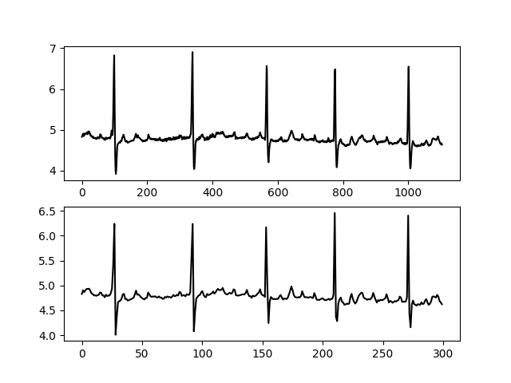<left>

## 2.8 利用小波变换去噪滤波，小波变换去趋势----wavelet_denoise、wavelet_detrend
有的时候需要对信号进行去噪。这里简单封装了一个小波去噪的方法，使用的是 小波pyhon库。去趋势也叫 ”基线偏移“，”基线漂移“，描述的都是同一个现象，即原波形被一种频率更低的波形干扰，而产生整体波形的移动。本函数封装了一个小波去趋势的方法，使用的是 小波pyhon库。因此使用时要注意安装软件  ```pip install PyWavelets```

使用代码举例：
```
import wfdb
import CPSC2021_function as CPSC2021
import matplotlib.pyplot as plt

patient_list = CPSC2021.get_patient_ids("C:/mycode/dataset/CPSC2021/")
index, info = CPSC2021.get_patient_info('data_81_3', patient_list)

# 读取患者文件
record = wfdb.rdrecord(patient_list[index], physical=True)
signal_annotation = wfdb.rdann(patient_list[index], "atr")

# 获取关键信息
ECG_rpeaks = signal_annotation.sample
ann_aux_note = signal_annotation.aux_note
ECG0 = record.p_signal[:, 0]
ECG1 = record.p_signal[:, 1]

# 获取采样点
signal_point = CPSC2021.signal_time_sample("00:00:15.455",len(ECG0))
signal1, s, e = CPSC2021.find_nR_peak(5, signal_point, ECG1, ECG_rpeaks)

# 去噪以及去趋势
signal0 = CPSC2021.wavelet_denoise(ECG0[s:e])
signal1 = CPSC2021.wavelet_detrend(signal0)

plt.subplot(3,1,1)
plt.plot(ECG0[s:e], color='k')
plt.subplot(3,1,2)
plt.plot(signal0, color='k')
plt.subplot(3,1,3)
plt.plot(signal1, color='k')
plt.show()
```
如图三个表，分别是原信号，去噪信号，去噪后去趋势
<left>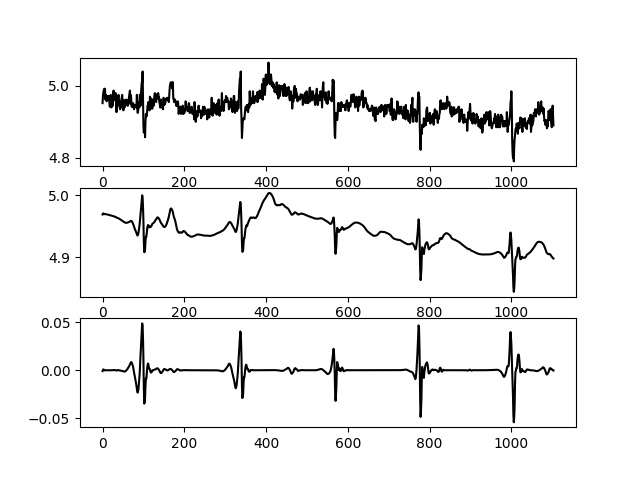<left>

