# MIT_BIH_AF
本文件夹是一个专门开发 MIT-BIH-AF 数据集的库

# 目录

- [1 介绍数据集 ](#1-介绍数据集)
  - [1.1 下载数据集](#下载数据集)
- [2 函数库使用](#2-函数库使用)
  - [2.1-读取dat,qrc,atr文件，获得 ECG_rpeaks，ann_aux_note，ann_sample，ECG0 ](#21-读取datqrcatr文件获得-ecg_rpeaksann_aux_noteann_sampleecg0)
  - [2.2-寻找时间点函数----signal_time_sample](#22-寻找时间点函数----signal_time_sample)
  - [2.3-寻找r_r峰在信号----find_r_r_peak](#23-寻找r_r峰在信号----find_r_r_peak)
  - [2.4-寻找-nr-峰信号以及位置----find_nr_peak](#24-寻找-nr-峰信号以及位置----find_nr_peak)
  - [2.5-找到范围内的所有-nr-峰----find_nr_peaks](#25-找到范围内的所有-nr-峰----find_nr_peaks)
  - [2.6-为信号建立伴随标注信号----afdb_create_mate_ann](#26-为信号建立伴随标注信号----afdb_create_mate_ann)
  - [2.7-重采样信号长度----resample_signal_length](#27-重采样信号长度----resample_signal_length)
  - [2.8-利用小波变换去噪滤波----wavelet_denoise](#28-利用小波变换去噪滤波----wavelet_denoise)
  - [2.9-利用小波变换去趋势----wavelet_detrend](#29-利用小波变换去趋势----wavelet_detrend)
  - [2.10 获取信号标签函数----find_signal_label](#210-获取信号标签函数----find_signal_label)

# 1 介绍数据集 
MIT-BIH-AF 是一个心电图信号房颤数据集。本文件夹则是针对该数据集开发的快捷使用函数。MIT-BIH-AF 数据集采集有 23 人的两导联数据。总长十个小时。单个病人约920万个数据点长度。注意,'00735', '03665' 病人没有 data 数据,虽然数据集有他们的标注但没有他们的信号，不可用。

<left>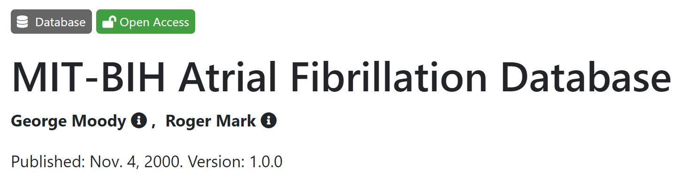<left>

## 下载数据集

数据集生理网下载地址：[https://www.physionet.org/content/afdb/1.0.0/](https://www.physionet.org/content/afdb/1.0.0/)

下载后,一共三种类型的文件，分别是dat,atr,qrc后缀。不需要担心三种文件的陌生感，已经有团队专门开发出读取这些文件的python集成包----WFDB。

因此，使用数据集前需要在python环境安装该库：```pip install wfdb```

生理网的资料做的很全，不仅提供的数据集的下载，网站还提供了数据集的很多详细说明，如记录时长，采样率，患者描述等。更多信息需要自己多探索，而最常用的是快捷波形可视化。

数据集可视化地址：[https://www.physionet.org/lightwave/?db=afdb/1.0.0](https://www.physionet.org/lightwave/?db=afdb/1.0.0)

可视化界面不仅显示了数据集的实际信号，而且对数据集的标注也显示了出来，单个病人数据量比较大所以网页端加载有些慢，打开可视化链接选择病人ID后耐心等待一会儿（大约20秒）。可视化界面如图：

<left>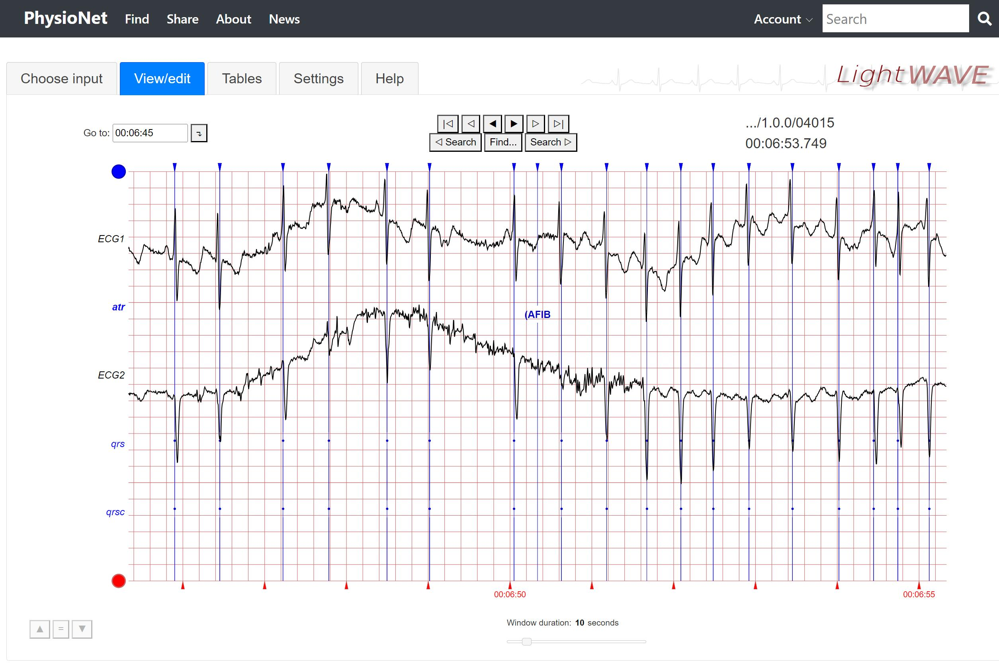<left>

其他可视化资源：[PhysioBank ATM 彩色版](https://archive.physionet.org/cgi-bin/atm/ATM)

# 2 函数库使用

如下介绍的库函数功能，都是平时用得最为频繁的基础功能，为了避免重复编写代码因此自己编写成库，使用代码```import MIT_BIH_AF_function as MIT_BIH_AF```将本文件夹代码库加载。

## 2.1 读取dat,qrc,atr文件，获得 ECG_rpeaks，ann_aux_note，ann_sample，ECG0 

使用数据集主要通过读取文件，其中dat后缀是记录心电实际信号的文件，atr后缀是心电实际信号对应的标注文件，qrs后缀是心电实际信号的每个R峰的标注文件。数据集所有的信息都在这三大文件中。
```
import wfdb

# 设置患者04015的路径
mit_bih_af_path = 'C:/mycode/dataset/mit-bih-atrial-fibrillation-database-1.0.0/files/04015'

# 读取患者文件
record = wfdb.rdrecord(mit_bih_af_path, physical=True)
signal_annotation = wfdb.rdann(mit_bih_af_path, "atr")
r_peak_annotation = wfdb.rdann(mit_bih_af_path, "qrs")

# 获取关键信息
ECG_rpeaks = r_peak_annotation.sample
ann_aux_note = signal_annotation.aux_note
ann_sample = signal_annotation.sample
ECG0 = record.p_signal[:, 0]

# 展示信号
import matplotlib.pyplot as plt
plt.plot(ECG0[0:2000])  # 打印输出 ECG0 信号0-2000的值
plt.show()
```

<left>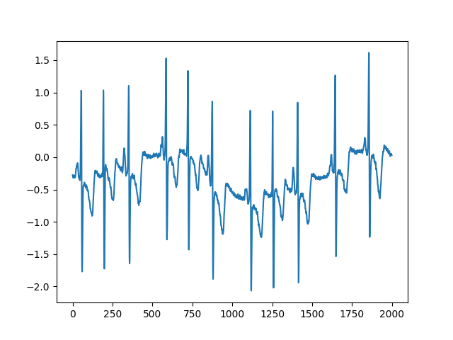<left>

## 2.2 寻找时间点函数----signal_time_sample
本函数用于在代码中找到我们看到的感兴趣段落的位置。
如可视化界面我们的时间点为 "00:06:50.316"。

<left>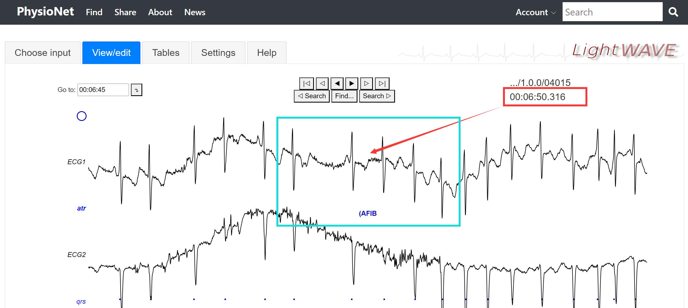<left>

获取该处时间点在信号中的索引值，并展示
```
import MIT_BIH_AF_function as MIT_BIH_AF 

# 输入时间点，获取该处时间点的索引值
index = MIT_BIH_AF.signal_time_sample("00:06:50.316","10:13:43",len(ECG0))

# 展示该索引值左右500的信号
import matplotlib.pyplot as plt
plt.plot(ECG0[index-500:index+500])  # 打印输出 ECG0 信号
plt.show()
```
<left>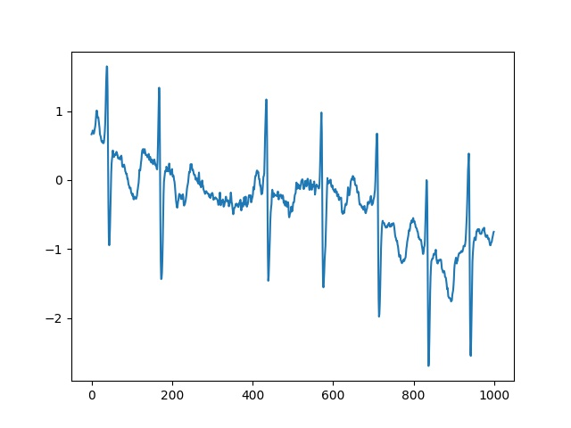<left>

## 2.3 寻找R_R峰信号以及其位置----find_R_R_peak
日常使用时经常遇到提取单个R峰的情况，本函数具备此功能。

使用代码举例：
```
import MIT_BIH_AF_function as MIT_BIH_AF

# 获取该处时间点的索引值
index = MIT_BIH_AF.signal_time_sample("00:06:48.817","10:13:43",len(ECG0))

# 根据索引值找到 R 峰信号，起点s, 终点e
signal, s, e = MIT_BIH_AF.find_R_R_peak(index, ECG0, ECG_rpeaks)

# 展示信号
import matplotlib.pyplot as plt
plt.plot(signal)  # 打印输出 signal 信号
plt.show()
```

|原采样点|采样出的R峰|
|:--------------:|:-----:|
|<left>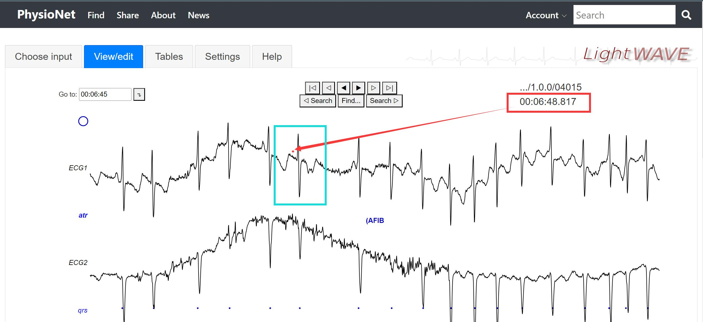<left>|<left>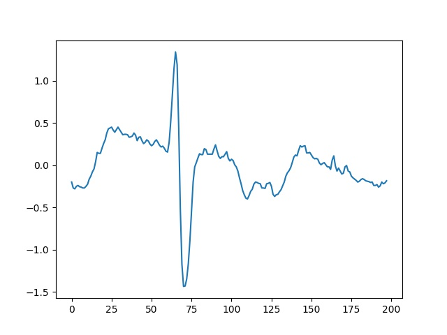<left>|

## 2.4 寻找 nR 峰信号以及位置----find_nR_peak
平时使用时，我们除了需要寻找一个 R 峰。我们还需要寻找 2，3，4，5，6，7....等n个连续R峰信号范围以及其信号位置。此函数可以完成此功能。

使用代码举例：
```
import MIT_BIH_AF_function as MIT_BIH_AF

# 获取 一个时间点的索引值
index = MIT_BIH_AF.signal_time_sample("00:07:54.819","10:13:43",len(ECG0))

# 根据索引值找到 9R 峰信号
signal, s, e = MIT_BIH_AF.find_nR_peak(9, index, ECG0, ECG_rpeaks)
```

原信号采样点如图：
<left>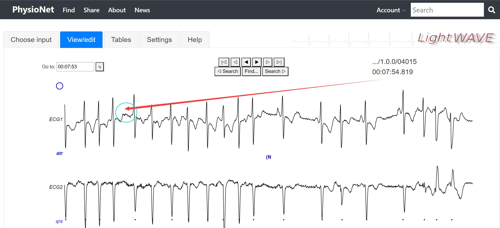<left>
|采集出 1R 峰|采集出 2R 峰|采集出 3R 峰|采集出 9R 峰|
|:-----:|:-----:|:-----:|:-----:|
|<left>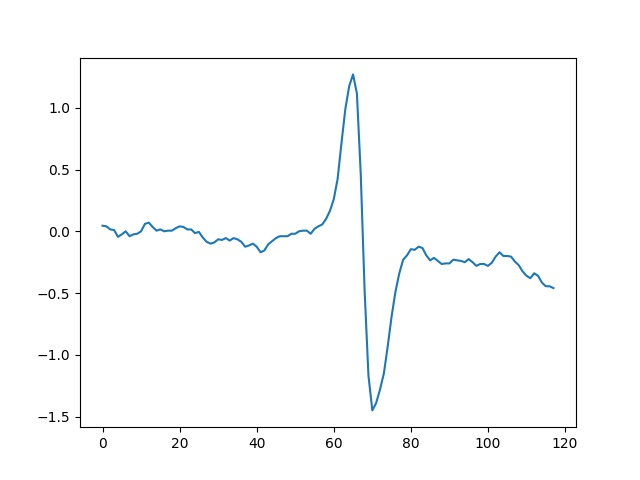<left>|<left>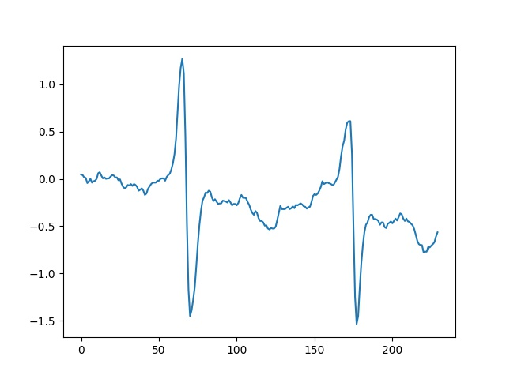<left>|<left>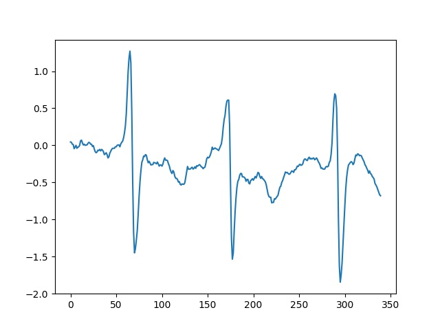<left>|<left>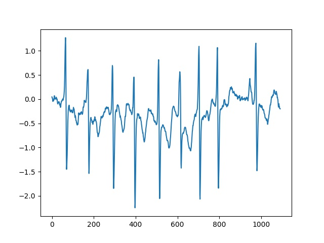<left>|

## 2.5 找到指定范围内的所有 nR 峰----find_nR_peaks
我们除了上面的要提取单独 nR 峰。很多情况下，我们还要在一段心电信号中提取出该段落的所有单个 nR 峰信号。下面代码展示了寻找一段信号中的所有 3R 峰的过程。

使用代码举例：
```
import MIT_BIH_AF_function as MIT_BIH_AF

# 获取 起点时间点的索引值
start_index = MIT_BIH_AF.signal_time_sample("00:06:48.067","10:13:43",len(ECG0))

# 获取 终点时间点的索引值
end_index = MIT_BIH_AF.signal_time_sample("00:06:51.764","10:13:43",len(ECG0))

# 根据索引值查找 3R 峰
r_peaks_position = MIT_BIH_AF.find_nR_peaks(3, start_index, end_index, ECG0, ECG_rpeaks)

for i in r_peaks_position: 
    r_signal = ECG0[i[0]:i[1]]
    
    # 展示信号
    import matplotlib.pyplot as plt
    plt.plot(r_signal)
    plt.show()
```
原信号片段
<left>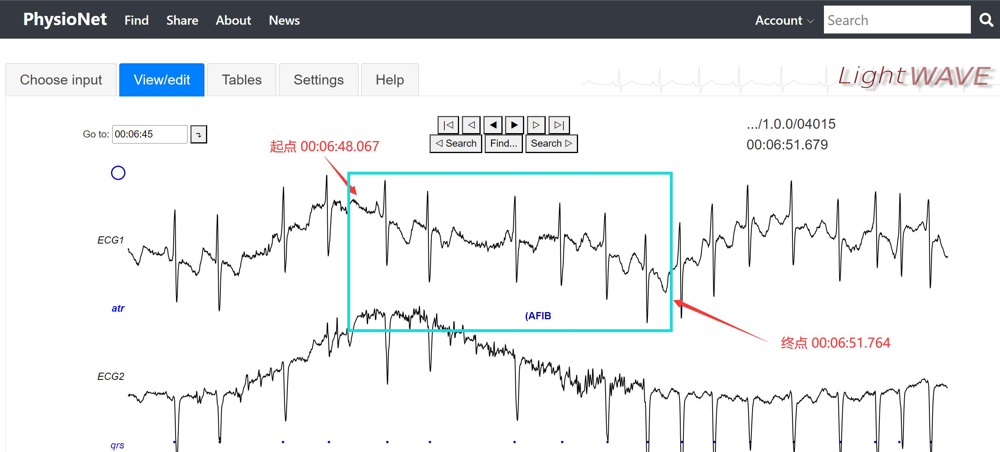<left>

找到的 R 峰
|第 1 个 3R 峰|第 2 个 3R 峰|第 3 个 3R 峰|第 4 个 3R 峰|
|----|----|----|----|
|<left>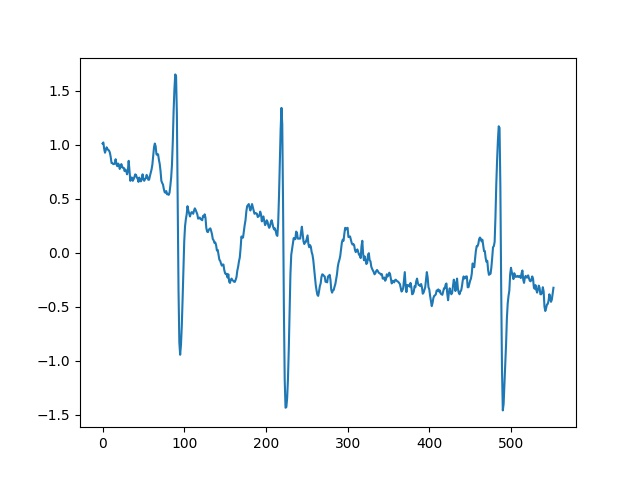<left> |<left>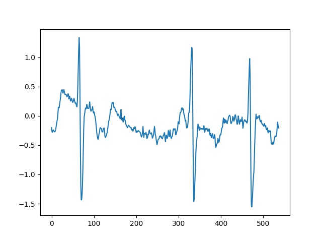<left> |<left>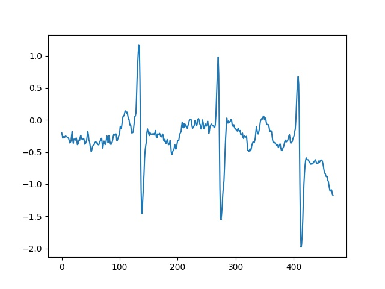<left> |<left>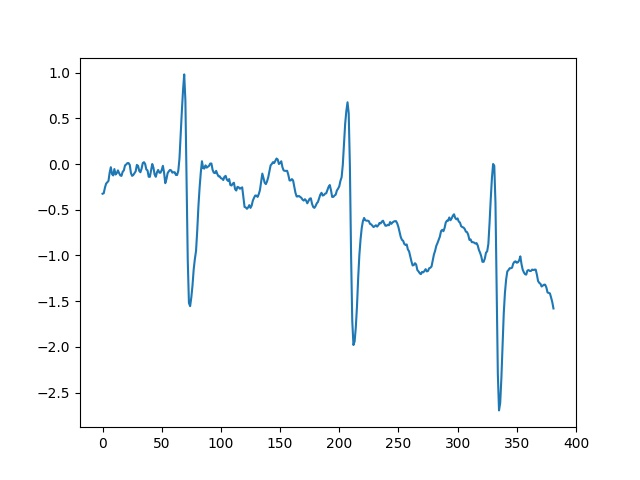<left> |


## 2.6 为信号建立伴随标注信号----AFDB_create_mate_ann
建立伴随标注信号在代码中存在很大的好处。使得波形提取对应的标注更加方便。避免麻烦的原信号标注类型寻找。如图下面的波形可视化原信号，根据atr文件的标注可以看到，患者发生了一秒左右的房颤。但数据集并不是对每一个点进行标注，伴随标注信号应运而生。
<left>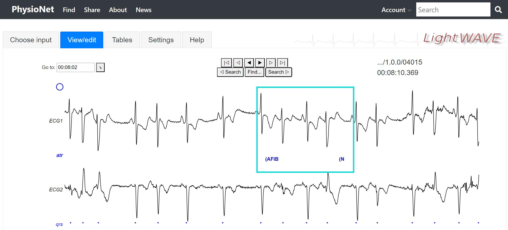<left>

使用代码举例：
```
import MIT_BIH_AF_function as MIT_BIH_AF

# 获取 一个起点时间点的索引值
start_index = MIT_BIH_AF.signal_time_sample("00:08:04.772","10:13:43",len(ECG0))

# 获取 一个终点时间点的索引值
end_index = MIT_BIH_AF.signal_time_sample("00:08:11.672","10:13:43",len(ECG0))

# 建立原信号的伴随标注信号
ECG_ann = MIT_BIH_AF.AFDB_create_mate_ann(len(ECG0), ann_sample, ann_aux_note)

# 展示波形
import matplotlib.pyplot as plt
plt.subplot(2,1,1)
plt.plot(ECG0[start_index:end_index])  # 展示原信号
plt.subplot(2,1,2)
plt.plot(ECG_ann[start_index:end_index])  # 展示标注波形
plt.show()
```
运行结果如下，下图中第一张表是原信号，第二张表是伴随标注信号（"1"代表房颤，"0"表示正常）

<left>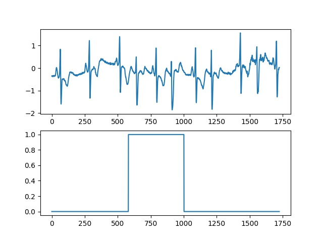<left>

## 2.7 重采样信号长度----resample_signal_length
在我们提取信号之后，最终将信号送入模型训练。但多数情况下，模型信号输入长度有要求。而我们采集的信号可能不是固定长度的，于是开发了本函数将一段信号重采样到指定的长度。注意本函数是基于 scipy 库实现的，如果出现缺少 scipy 库缺失相关的报错，请使用  ```pip install scipy```

使用代码举例：
```
import MIT_BIH_AF_function as MIT_BIH_AF

# 获取 一个起点时间点的索引值
start_index = MIT_BIH_AF.signal_time_sample("00:08:04.772","10:13:43",len(ECG0))

# 寻找一段 R 峰信号
signal, s, e = MIT_BIH_AF.find_R_R_peak(start_index, ECG0, ECG_rpeaks)

# 将信号长度重采样到500
resample_signal = MIT_BIH_AF.resample_signal_length(signal, 500)
```
运行结果如图，原信号长度 200（蓝色），重采样到了 500 长度（橙色）

<left>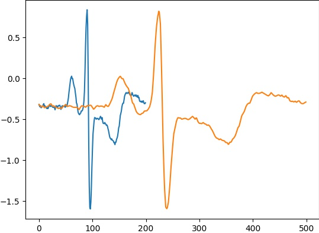<left>

## 2.8 利用小波变换去噪滤波----wavelet_denoise
有的时候需要对信号进行去噪。这里简单封装了一个小波去噪的方法，使用的是 小波pyhon库。因此使用时要注意安装软件  ```pip install PyWavelets```

使用代码举例：
```
import MIT_BIH_AF_function as MIT_BIH_AF

# 获取 一个起点时间点的索引值
start_index = MIT_BIH_AF.signal_time_sample("00:08:04.772","10:13:43",len(ECG0))

# 寻找一段 R 峰信号
signal, s, e = MIT_BIH_AF.find_R_R_peak(start_index, ECG0, ECG_rpeaks)

# 对一段信号进行小波去噪
denoise_signal = MIT_BIH_AF.wavelet_denoise(signal)
```
|原信号|去噪之后的信号|
|---|---|
|<left>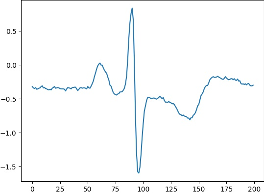<left>|<left>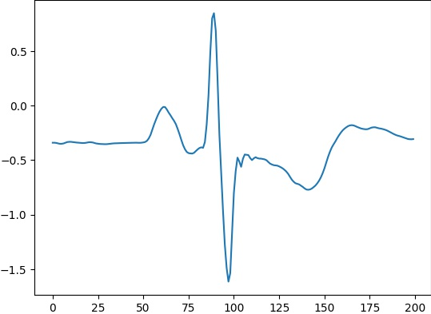<left>|

## 2.9 利用小波变换去趋势----wavelet_detrend
去趋势也叫 ”基线偏移“，”基线漂移“，描述的都是同一个现象，即原波形被一种频率更低的波形干扰，而产生整体波形的移动。本函数封装了一个小波去趋势的方法，使用的是 小波pyhon库。因此使用时要注意安装软件  ```pip install PyWavelets```

使用代码举例：
```
import MIT_BIH_AF_function as MIT_BIH_AF

# 获取 一个时间点的索引值
index = MIT_BIH_AF.signal_time_sample("00:06:48.772","10:13:43",len(ECG0))

# 获取一段信号，该时间点左右 800 范围
signal = ECG0[index-800:index+800]

# 将信号进行去趋势处理
detrend_signal = MIT_BIH_AF.wavelet_detrend(signal)
```
|原信号|去趋势处理的信号|
|---|---|
|<left>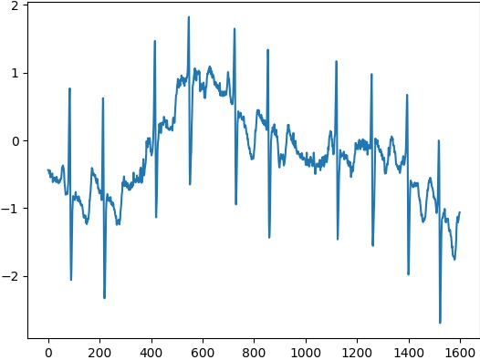<left>|<left>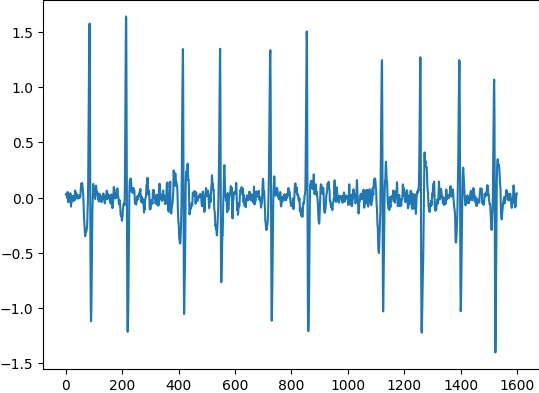<left>|


## 2.10 获取信号标签函数----find_signal_label
本函数用于获取一段信号所属的类别标签。虽然数据集已经对R峰进行了标注，但很多情况我们提取出了多R峰，就要同时为这个多R峰带上类别标签。
使用此函数使用时要搭配 AFDB_create_mate_ann() 伴随函数使用。将伴随列表作为输入。

<left>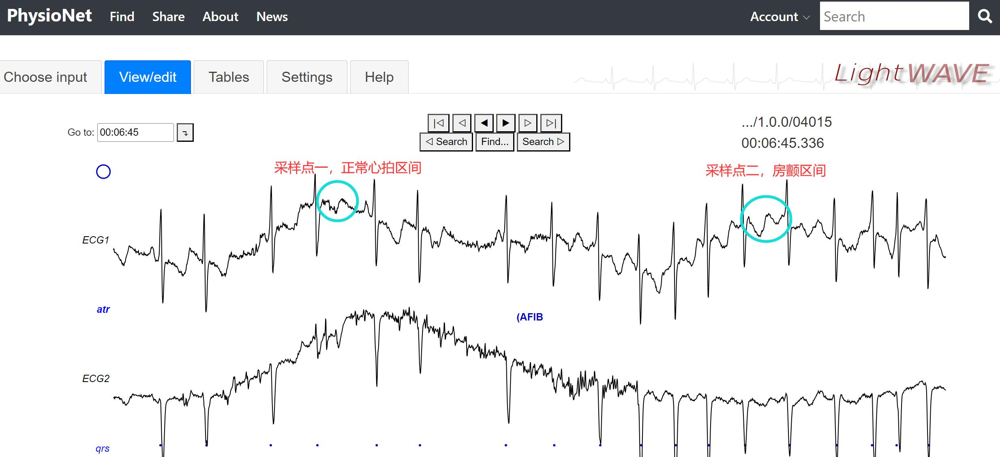<left>
采样上面的时间点，然后给出类别标签。

使用代码举例：
```
import MIT_BIH_AF_function as MIT_BIH_AF

# 获取时间点的索引值
point1 = MIT_BIH_AF.signal_time_sample("00:06:47.988","10:13:43",len(ECG0))
point2 = MIT_BIH_AF.signal_time_sample("00:06:53.186","10:13:43",len(ECG0))

# 根据索引值查找 2R 峰
signal1, s1, e1 = MIT_BIH_AF.find_nR_peak(2, point1, ECG0, ECG_rpeaks)
signal2, s2, e2 = MIT_BIH_AF.find_nR_peak(2, point2, ECG0, ECG_rpeaks)

# 创建一个关于信号的伴随列表
ECG_ann = MIT_BIH_AF.AFDB_create_mate_ann(len(ECG0), ann_sample, ann_aux_note)

label1 = MIT_BIH_AF.find_signal_label(s1, e1, ECG_ann)
label2 = MIT_BIH_AF.find_signal_label(s2, e2, ECG_ann)

print("采样点1    00:06:47.988 处的标签是：", label1)
print("采样点2    00:06:53.186 处的标签是：", label2)
```
输出：
```
采样点1    00:06:47.988 处的标签是： 0
采样点2    00:06:53.186 处的标签是： 1
```
结合如上波形图，代码输出正确。